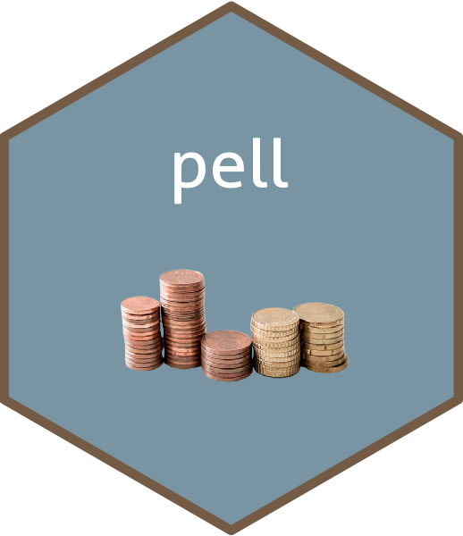
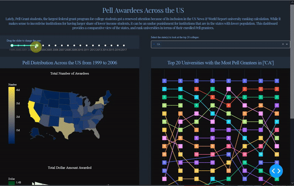

```{r, include = FALSE}
knitr::opts_chunk$set(
  collapse = TRUE,
  comment = "#>",
  warning = FALSE,
  message = FALSE,
  out.width = "100%"
)
```


```{r setup, include=FALSE}
library(pell)
library(dplyr)
library(ggplot2)
theme_set(theme_minimal())
```

The `pell` R package contains two datasets that we believe are a viable alternative to Anderson's **Iris** data (see `datasets::iris`). In this introductory vignette, we'll highlight some of the properties of these datasets that make them useful for statistics and data science education, as well as software documentation and testing.





## Installation

You can install the released version of `pell` from [CRAN](https://CRAN.R-project.org) with:

``` r
install.packages("pell")
```

Or install the development version from [GitHub](https://github.com/) with:

```{r eval=FALSE}
install.packages("devtools")
devtools::install_github("Curious-Joe/pell")
```

## The **pell** package

This package contains one dataset called - pell. Take a glimpse at the data:

```{r}
glimpse(pell)
```

The `pell::pell` data contains `r sum(complete.cases(pell))` complete cases, with `r sum(is.na(pell))` missing values.

```{r eval=FALSE}
visdat::vis_dat(pell)
```

## Highlights

Without going much into the details, here are few code snippet to get you started with the `pell` dataset. You can check out more in `vignette("examples")`.

### Exploring factors

The `pell` data has three factor variables:

```{r}
pell %>%
  dplyr::select(where(is.factor)) %>% 
  glimpse()
```

Get the top 10 states with the highest median Pell grant record:

```{r}
# Top 10 institutions with the highest pell grant disbursements
pell %>%
  group_by(STATE) %>%
  summarise(
    Median = median(.data$AWARD, na.rm = TRUE)
  ) %>%
  arrange(desc(Median)) %>%
  head(10) %>%
  knitr::kable(caption = "Top 10 States with the Highest Median Grant Distribution")
```

Get a treemap of all the states based on their total paid out grant dollars:

```{r message=FALSE}
library(treemap)
treemap(pell,
            index=c("STATE"),
            vSize="AWARD",
            type="index",
            
            ) 
```

### More

If you are a Python user, you may find interest in checking a [dash app]() that I created earlier using the same data. Check out the app repository [here](https://github.com/Curious-Joe/Pell-Awardees-in-US-Colleges). Here's a preview of the app:

<p align="center">
  
</p>

I will try to put some more R examples in `vignette("examples")` but currently it's not populated.

So keep an eye on that or do you own analysis and contribute your own!


## Package citation 

Please cite the `pell` R package using: 

```{r}
citation("pell")
```

Have fun with the pell grant data!

***

Thanks to the [`palmerpenguins`](https://github.com/allisonhorst/palmerpenguins) package for their great vignette. I used the vignette from that package as a skeleton and populated this vignette with relevant contents. A big shout out to them and a hearfelt thank you 🙏
